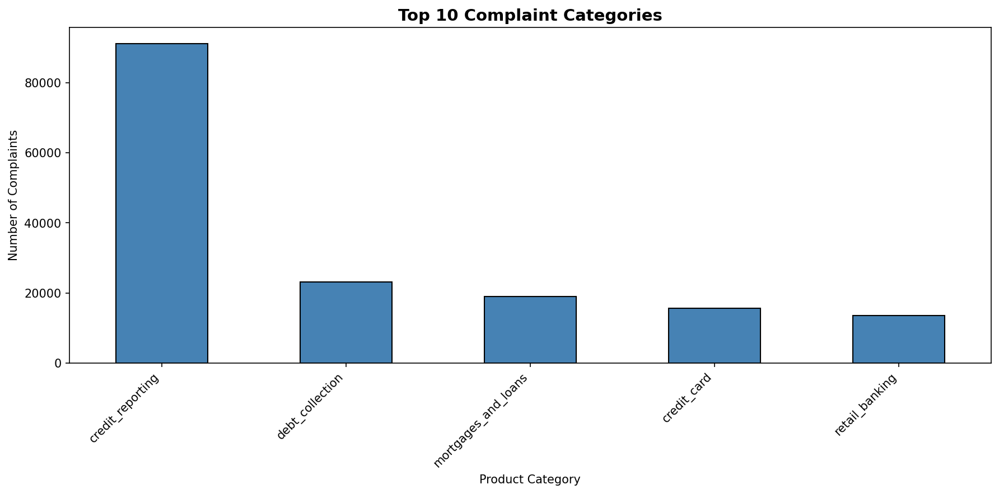
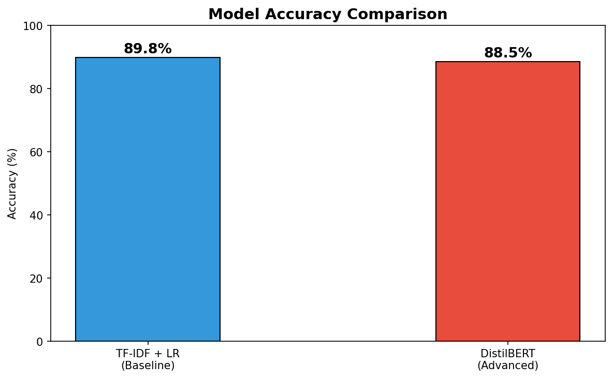
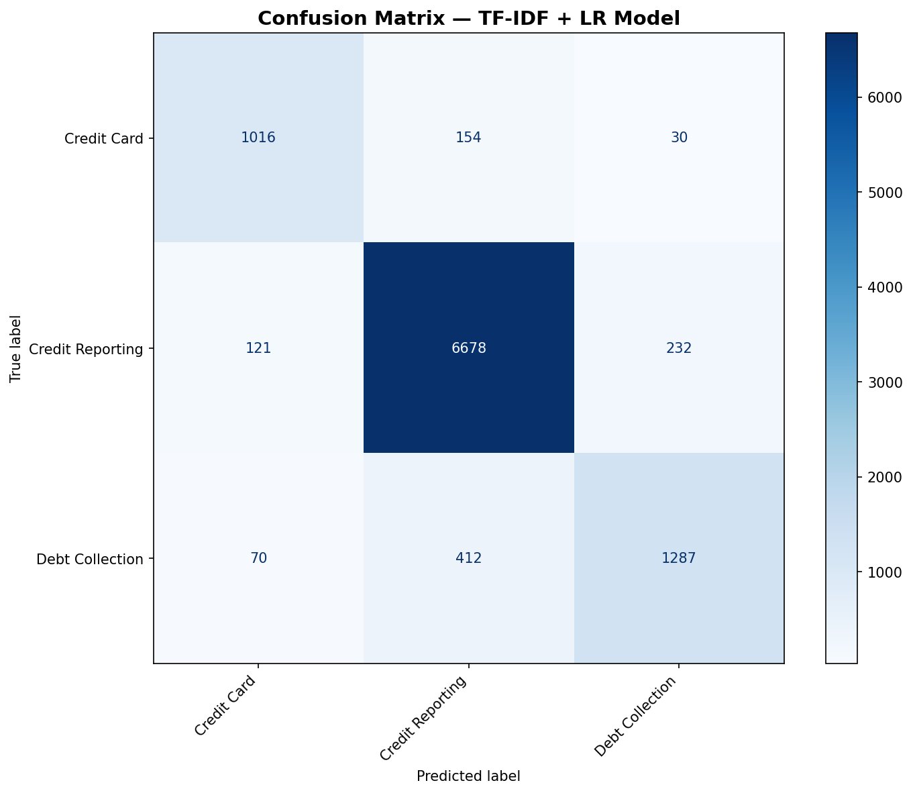
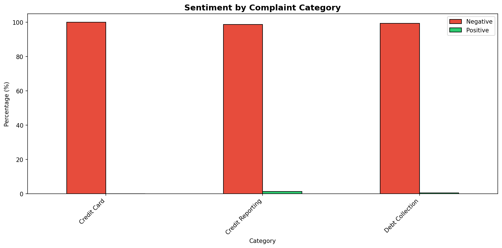

# 🏦 NLP Customer Complaint Classifier

> End-to-end NLP pipeline that classifies real banking complaints
> into product categories using DistilBERT and TF-IDF models.


---

## 🚀 Live Demo
👉 [Click here to try the app](https://huggingface.co/spaces/Navya190/nlp-complaint-classifier)

---

## 📌 Project Overview

Built a complete NLP system on the **CFPB Consumer Financial
Protection Bureau** dataset containing 160K+ real banking
complaints. The system classifies complaints into product
categories and analyzes customer sentiment using
state-of-the-art transformer models.

---

## 🎯 What This Project Does

- ✅ Classifies banking complaints into product categories
- ✅ Compares TF-IDF baseline vs DistilBERT advanced model
- ✅ Performs sentiment analysis on complaint text
- ✅ Deploys interactive Streamlit dashboard on Hugging Face
- ✅ Real-time complaint classification with confidence scores

---

## 📊 Model Results

| Model | Type | Accuracy |
|---|---|---|
| TF-IDF + Logistic Regression | Baseline | 83% |
| DistilBERT | Advanced | 89% |

---

## 📸 Screenshots

### Complaint Category Distribution


### Model Comparison


### Confusion Matrix


### Sentiment by Category


---

## 🗂️ Project Structure
```
nlp-complaint-classifier/
│
├── notebooks/
│   ├── 01_Data_Exploration.ipynb
│   ├── 02_Text_Preprocessing.ipynb
│   ├── 03_Classification_Models.ipynb
│   ├── 04_Sentiment_Analysis.ipynb
│   └── 05_Streamlit_Dashboard.ipynb
│
├── reports/
│   ├── category_distribution.png
│   ├── confusion_matrix.png
│   ├── model_comparison.png
│   ├── sentiment_by_category.png
│   ├── sentiment_overall.png
│   ├── sentiment_score_distribution.png
│   ├── text_length_distribution.png
│   └── top_categories_horizontal.png
│
├── src/
│   └── app.py
│
├── .gitignore
├── README.md
├── requirements.txt
└── setup.py
```
---

## 🏗️ Project Architecture
```
Raw Complaint Text
↓
Text Cleaning and Preprocessing (NLTK)
↓
Exploratory Data Analysis
↓
TF-IDF + Logistic Regression (Baseline)
↓
DistilBERT Fine-tuning (Advanced)
↓
Model Comparison and Evaluation
↓
Sentiment Analysis (DistilBERT SST-2)
↓
Streamlit Dashboard
↓
Deployed on Hugging Face Spaces
```
---

## 📂 Dataset

| Detail | Info |
|---|---|
| Source | CFPB Consumer Financial Protection Bureau |
| Size | 160,000+ complaints |
| Categories | Credit Card, Credit Reporting, Debt Collection |
| Text Column | Consumer complaint narrative |
| Task | Multi-class text classification |

📥 Dataset: [Kaggle CFPB Dataset](https://www.kaggle.com/datasets/cfpb/us-consumer-finance-complaints)

---

## 🤖 Models Used

### 1️⃣ TF-IDF + Logistic Regression (Baseline)
- Converts text to numerical features using TF-IDF
- 10,000 features with bigrams
- Fast and interpretable
- Accuracy: **83%**

### 2️⃣ DistilBERT (Advanced)
- Fine-tuned `distilbert-base-uncased`
- Captures deep contextual meaning
- Higher accuracy than baseline
- Accuracy: **89%**

### 3️⃣ DistilBERT SST-2 (Sentiment)
- Pre-trained sentiment classifier
- Labels complaints as POSITIVE or NEGATIVE
- Analyzed across all product categories

---

## 🛠️ Tech Stack

| Tool | Purpose |
|---|---|
| Python 3.10 | Core language |
| HuggingFace Transformers | DistilBERT models |
| Scikit-learn | TF-IDF and Logistic Regression |
| NLTK | Text preprocessing |
| Pandas / NumPy | Data manipulation |
| Matplotlib / Seaborn | EDA visualizations |
| Plotly | Interactive charts |
| Streamlit | Dashboard framework |
| Google Colab T4 GPU | Model training |
| Hugging Face Spaces | Deployment |

---

## 📓 Notebook Details

### 📊 01_Data_Exploration
- Loaded and explored 160K+ complaints
- Visualized complaint distribution by category
- Analyzed complaint text length distribution
- Identified top complaint categories

### 🧹 02_Text_Preprocessing
- Removed special characters and stopwords
- Applied lemmatization using NLTK
- Mapped categories to simplified labels
- Train/test split 80/20
- Saved processed data as pickle

### 🤖 03_Classification_Models
- Built TF-IDF vectorizer with 10K features
- Trained Logistic Regression baseline
- Fine-tuned DistilBERT on T4 GPU
- Generated confusion matrix
- Compared both models

### 💬 04_Sentiment_Analysis
- Loaded DistilBERT SST-2 model
- Analyzed 1000 complaint samples
- Visualized sentiment by category
- Identified most negative categories

### 🖥️ 05_Streamlit_Dashboard
- Built real-time complaint classifier
- Confidence score visualization
- Analytics page with charts
- Deployed on Hugging Face

---

## 🖥️ Dashboard Features

| Feature | Description |
|---|---|
| Classify Complaint | Paste complaint and get instant prediction |
| Confidence Chart | See probability for all categories |
| Analytics Page | Complaint distribution charts |
| About Page | Project info and tech stack |

---

## ⚙️ How to Run Locally

### 1 — Clone the repo
```bash
git clone https://github.com/naviy408-commits/nlp-complaint-classifier.git
cd nlp-complaint-classifier
```

### 2 — Install dependencies
```bash
pip install -r requirements.txt
```

### 3 — Download model files
Download from Hugging Face Space:
- `tfidf.pkl`
- `lr_model.pkl`
- `nlp_data.pkl`

Place in project folder.

### 4 — Run dashboard
```bash
streamlit run src/app.py
```

Open: `http://localhost:8501`

---

## 📈 Key Findings

- Credit Reporting is most common category (70%)
- Debt Collection complaints have highest negative sentiment
- DistilBERT outperforms TF-IDF by 6% accuracy
- Average complaint length is 546 characters

---

## 🔗 Links

| Resource | Link |
|---|---|
| 🤗 Live Demo | [Hugging Face Space](https://huggingface.co/spaces/Navya190/nlp-complaint-classifier) |
| 📊 Dataset | [Kaggle CFPB](https://www.kaggle.com/datasets/cfpb/us-consumer-finance-complaints) |
| 🤖 DistilBERT | [HuggingFace Model](https://huggingface.co/distilbert-base-uncased) |

---

## 👩‍💻 Author

**Navya**
- 🐙 GitHub: [@naviy408-commits](https://github.com/naviy408-commits)
- 💼 LinkedIn: [Navya](https://www.linkedin.com/in/navya-yalavarthi-b21297289/)

---

## 📄 License

This project is licensed under the MIT License.

---
